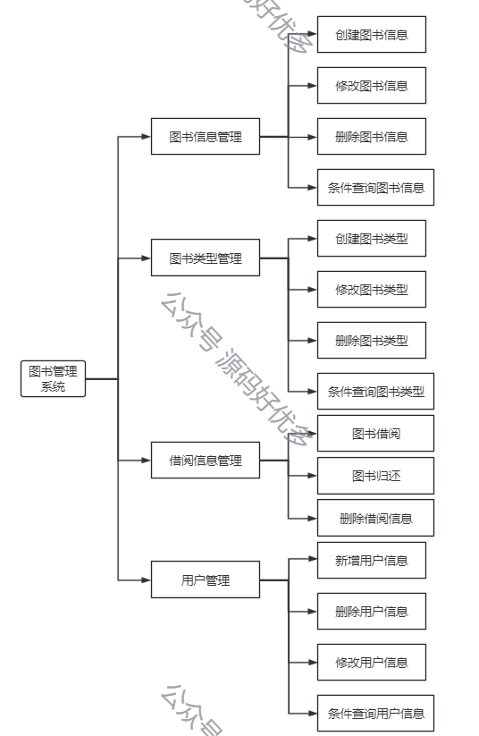
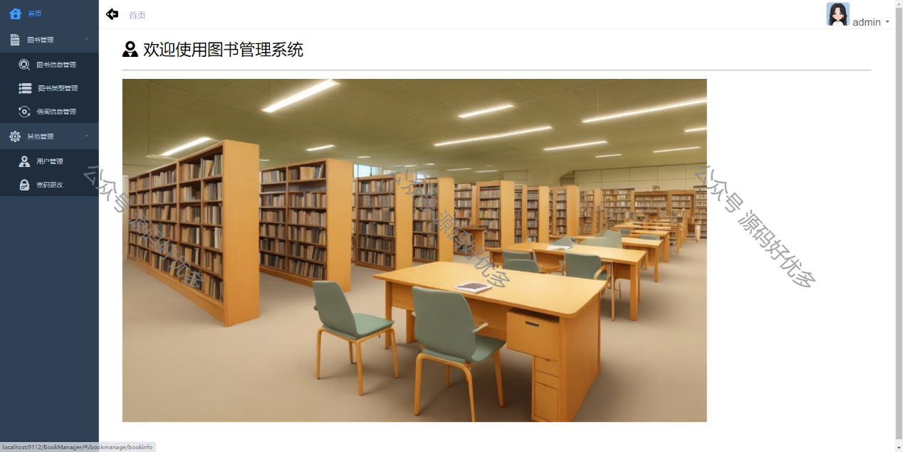
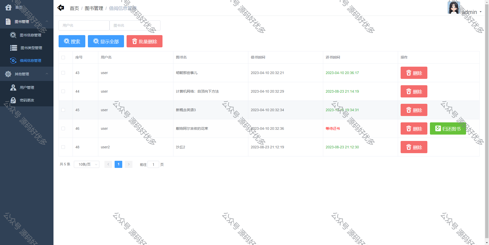
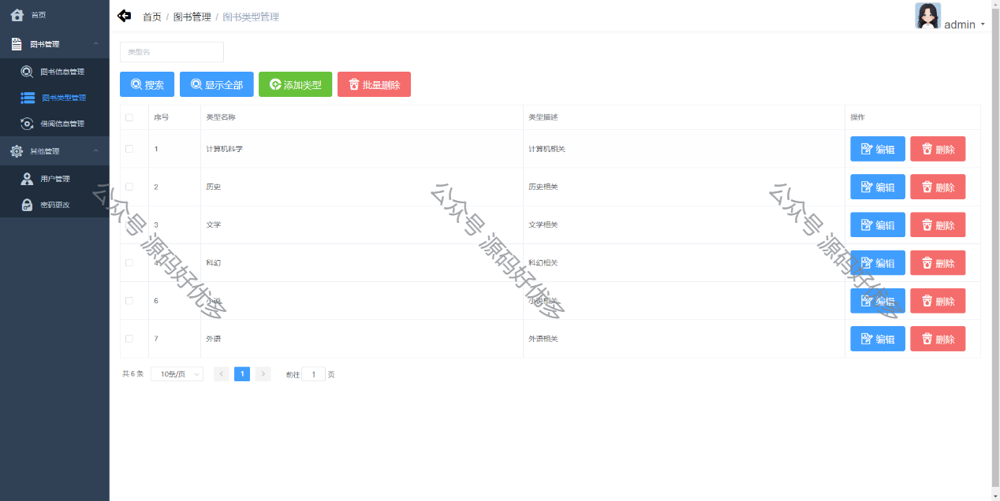
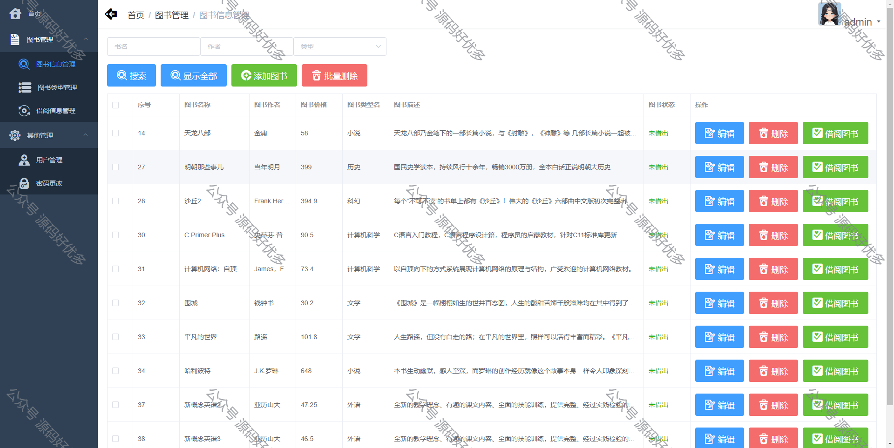
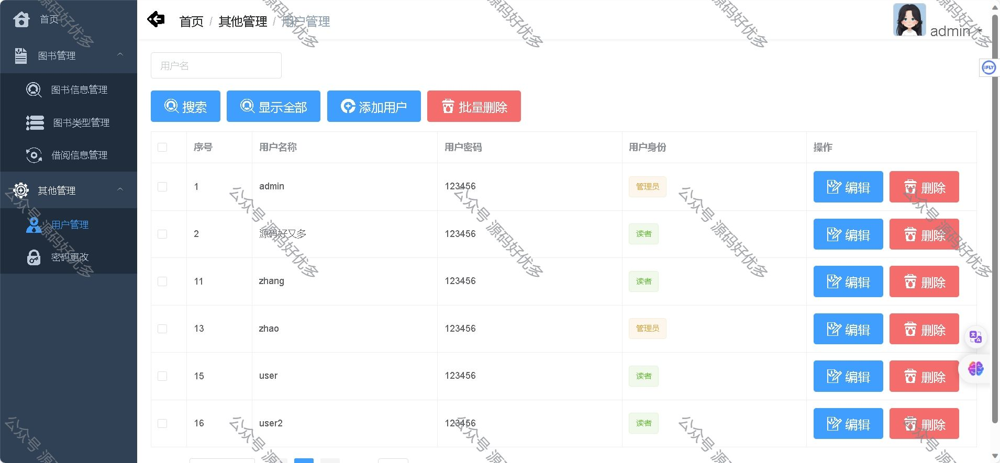
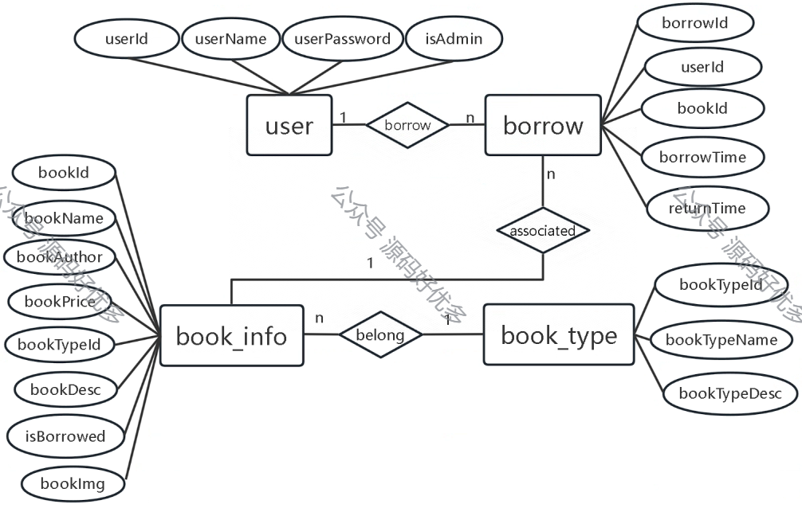

### 一、作品包含

源码+数据库+设计文档+全套环境和工具资源+部署教程

### 二、项目技术

前端技术：Html、Css、Js、Vue、Element-ui

数据库：MySQL

后端技术：Java、Spring Boot、MyBatis

### 三、运行环境

开发工具：IDEA/eclipse

数据库：MySQL8.0

数据库管理工具：Navicat10以上版本

环境配置软件： JDK1.8+Maven3.6.3

前端Nodejs：16

### 四、项目介绍

项目编号：springbootA017
该图书管理系统提供了一系列功能，包括图书管理、图书类型管理、读者借阅归还图书、用户管理和重置密码等。
在图书管理功能中，管理员可以方便地进行图书信息的管理。他们可以添加新的图书记录，包括书名、作者、出版社、ISBN等信息，并可以对已有的图书进行编辑和删除操作。管理员还可以查看图书的借阅情况和库存信息，以便进行库存管理和统计。
图书类型管理功能允许管理员对图书进行分类管理。他们可以创建不同的图书类型，如小说、科幻、历史等，并可以为每个类型指定相应的属性和特征。这样可以更好地组织和管理图书馆的图书资源。
读者借阅归还图书功能使读者能够方便地借阅和归还图书。读者可以通过系统查询图书的可借状态，并选择需要借阅的图书。借阅期限和归还日期也会在系统中记录，以便提醒读者及时归还图书。管理员可以对借阅记录进行管理和统计，以便跟踪图书的借阅情况。
用户管理功能允许管理员管理系统的用户账号。他们可以创建新的用户账号，并为每个账号分配相应的权限和角色。管理员还可以对用户账号进行编辑和删除操作，以确保系统的安全性和合规性。
最后，重置密码功能允许用户在忘记密码时进行密码重置。用户可以通过提供相关的身份验证信息来重置密码，以便重新获得对系统的访问权限。
通过以上功能，该图书管理系统能够提供便捷的图书管理和借阅服务，提高图书馆的管理效率和读者的使用体验。

### 五、运行截图

